# Battleship
Battleship is a strategy-type guessing game for two players. It is played on ruled grids on which each player's fleet of warships is marked. The locations of the fleets are concealed from the other player. Players alternate turns calling "shots" at the other player's ships, and the objective of the game is to destroy the opposing player's fleet.
In this version, each boat occupies a 1 per 1 square and the opponent is the computer. All its functions have been randomized using python.

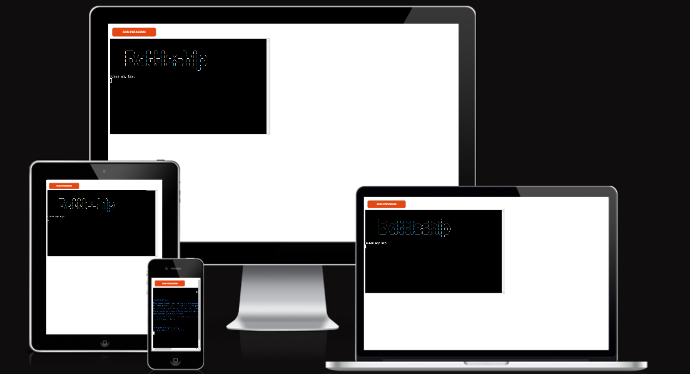

[Click here to go to the live website!](https://cool-battle-ship.herokuapp.com/)

## Table of contents 
1. [User experience](#user-experience)
2. [Structure](structure)
4. [Features](#features)
5. [Testing](#testing)
6. [Bugs](#bugs)
7. [Final product](#final-product)
8. [Deployment](#deployment)

9. [Credits](#credits)

## User experience

### User Goals:

First-time visitor goals:
* The concept of the game must be engaging

* Easy to understand the rules

* Easy navigation

Frequent user goals
* Check if any features are added since the last time the game was played.

User expectations:
* The game should be engaging and display a winner/loser result.

* The instructions are clear and simple to follow.

* The game is fun to play

### Project Goals:

* The game provides a structure that is easy to understand, navigate and interact with.

* Contains fun colours and interactivity to engage the player in the game.

* Customisation of the size of the board and the number of ships.

* Incorporates a rules section that is easily accessible and understandable to the player.

* Player can play as many times as he wants without the need of refreshing

### Color scheme

* Blue ("\033[0;34m"): General text.

* Red ("\033[0;31m"): Error or wrong input.

* Green ("\033[0;32m"): Correct hit

* White ("\033[0;37m"): Board display, title and final message

## Structure 

The game mechanics were conceived before starting to code. A flow chart was used for the process:

* Blue: Shows either an input from the user, a calculation made by the program or displays of information on the terminal

* Red: Validation of the input

* Green: The flow chart continues on the next green circle

Here we can see the game mechanics flowchart:
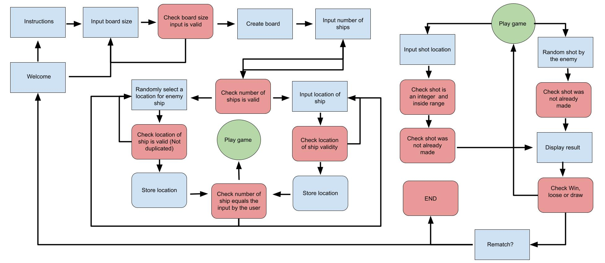

## Features

Existing features:

* User selects the difficulty of the game:

    * Chooses the size of the board. Rows and columns are set independently, no need for a square board. Sizes can be set between 3 and 6.

    * Chooses the number of ships. Limited to 8, since the smallest board permitted has 9 locations.

* Enemy actions are randomized:

    * Placement of ships

    * Shooting the user

* User actions are made by him:

    * The location of his boats
    
    * Shooting the enemy

* User and enemy board:

    * @: marks the location of a boat (Only for the user board).

    * *: marks an empty location (User board) or an unknown location (enemy board).

    * X (green): marks a boat that has been hit by the other player.

    * 0 (red): marks an empty location that has been shot.

Game screen screenshot:

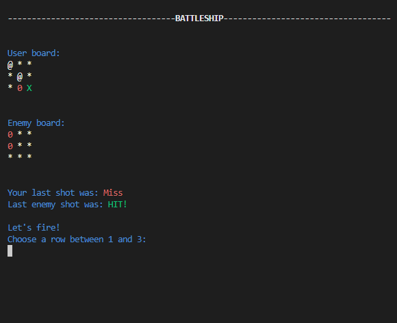

* Result message using ASCII art:

    * Different for win, loss or draw

Results screen screenshot:

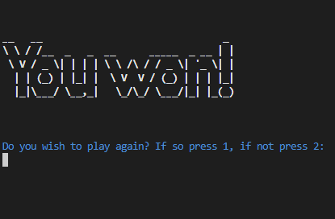
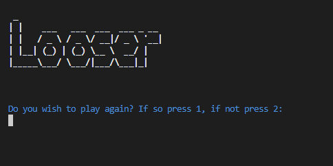
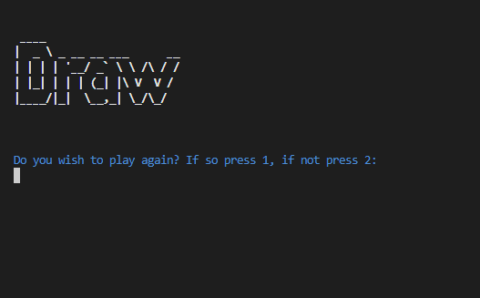

* Other features:

    * Instructions section

    * Game can be repeated or ended at the end of each match-up.

    * Input errors are shown in red

    * Terminal clears to avoid saturation of the console

    * Title of the game is always shown

Future Features:

* Ships with different sizes

* Online matches

## Testing

### Validator testing

GitPod was used as a validator testing. As seen in the image below, GitPod reported 101 problems related to the code. After cleaning up, all the red and many yellow errors were removed. Note that the terminal still reported 101 yellow errors. All of the errors were due to the ASCII art print statements.
Here we can see the GitPod errors before:

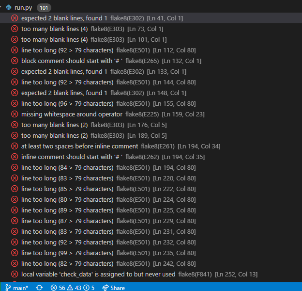

### Manual testing

Welcome page

TEST            | OUTCOME                          | PASS / FAIL  
--------------- | -------------------------------- | ---------------
Enter "1" | On entering "1", it directs me to the instructions section| PASS
Entering "2"|  On entering "2", it directs me to the game set-up section| PASS
Entering something different from 1 or 2| Displays error message and asks user to enter 1 or 2| PASS
Blank enter| Displays error message and asks the user to enter 1 or 2| PASS
Enter " 1" or " 2"| Displays error message and asks the user to enter 1 or 2| PASS

Testing screenshot:

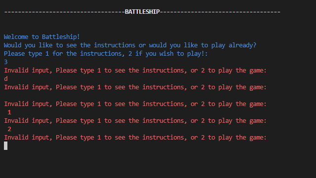

Instructions section

TEST            | OUTCOME                          | PASS / FAIL  
--------------- | -------------------------------- | ---------------
Enter "1" | On entering "1", it directs me to the game set-up section| PASS
Entering something different from 1| Displays error message and asks user to enter 1| PASS
Blank enter| Displays error message and asks the user to enter 1| PASS
Enter " 1"| Displays error message and asks the user to enter 1 or 2| PASS

Testing screenshot:

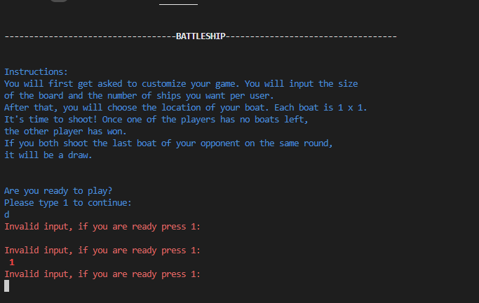

Board dimensions
TEST            | OUTCOME                          | PASS / FAIL  
--------------- | -------------------------------- | ---------------
Row input| On entering a row input between 3 and 6, it direct's you to the column section.| PASS
Row wrong input| On entering a row input different from 3 and 6, displays an error message and asks the user for valid input| PASS
Row blank enter| Displays error message and asks the user to enter a valid input.| PASS
Column input| On entering a column input between 3 and 6, it direct's you to the boat section.| PASS
Column wrong input| On entering a column input different from 3 and 6, displays an error message and asks the user for valid input| PASS
Column blank enter| Displays an error message and asks the user to enter a valid input.| PASS

Testing screenshot:

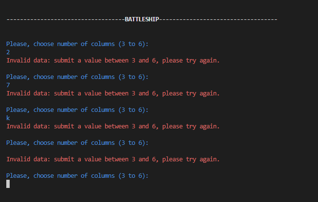

Number of boats
TEST            | OUTCOME                          | PASS / FAIL  
--------------- | -------------------------------- | ---------------
Boat input| On entering a boat input between 3 and 8, it direct's you to the manual boat placement section.| PASS
Boat wrong input| On entering a boat input different from 3 and 8, displays an error message and asks user for a valid input| PASS
Boat blank enter| Displays an error message and asks the user to enter a valid input.| PASS

Testing screenshot:

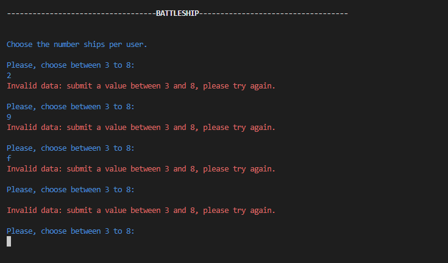

Manual boat placement
TEST            | OUTCOME                          | PASS / FAIL  
--------------- | -------------------------------- | ---------------
Row input| On entering a row input between 1 and the number of rows chosen, it direct's you to the column section.| PASS
Row wrong input| On entering a row input diferent from 1 and the number of rows chosen, displays an error message and asks the user for a valid input. | PASS
Column blank enter| Displays an error message and asks the user to enter a valid input.| PASS
Column input| On entering a column input between 1 and the number of columns chosen, it direct's you to the next section.| PASS
Column wrong input| On entering a column input diferent from 1 and the number of column chosen, displays an error message and asks the user for a valid input. | PASS
Column blank enter| Displays an error message and asks the user to enter a valid input.| PASS
Duplicate value | Displays a duplicate error message and asks the user to enter a valid input.| PASS

Testing screenshot:

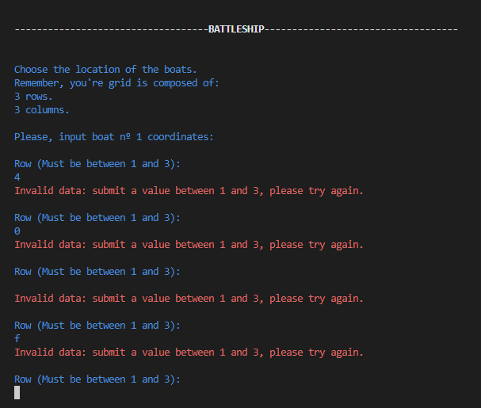
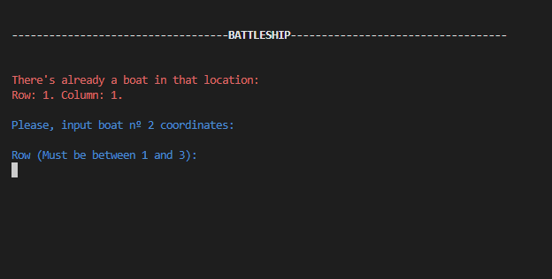

Shooting
TEST            | OUTCOME                          | PASS / FAIL  
--------------- | -------------------------------- | ---------------
Row input| On entering a row input between 1 and the number of rows chosen, it direct's you to the column section.| PASS
Row wrong input| On entering a row input different from 1 and the number of rows chosen, displays an error message and asks user for a valid input. | PASS
Column blank enter| Displays an error message and asks the user to enter a valid input.| PASS
Column input| On entering a column input between 1 and the number of columns chosen, it direct's you to the next section.| PASS
Column wrong input| On entering a column input different from 1 and the number of column chosen, displays an error message and asks the user for a valid input. | PASS
Column blank enter| Displays an error message and asks the user to enter a valid input.| PASS
Duplicate value | Displays a duplicate error message and asks the user to enter a valid input.| PASS

Testing screenshot:

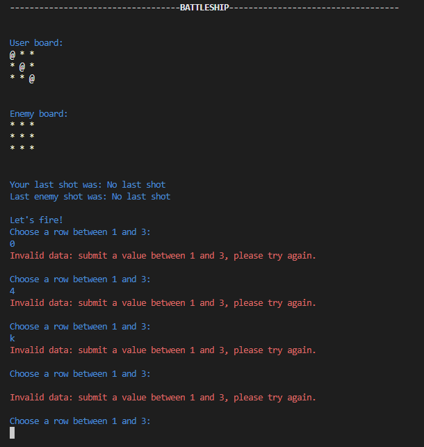
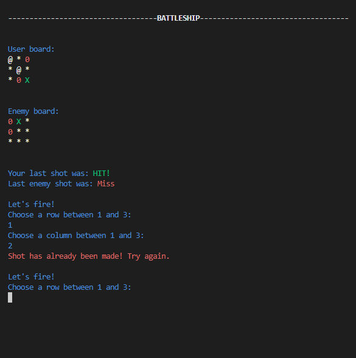

## Bugs

No bugs were encountered. The game runs indefinitely as long as the user wants without any problems.

## Final product

Welcome page:

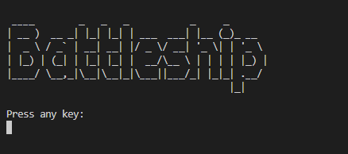

Instructions page:

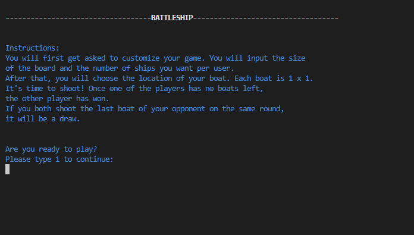

Boat input:

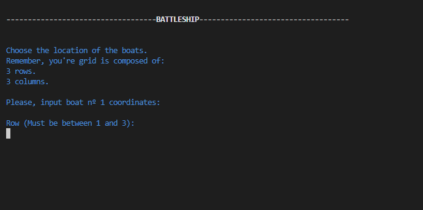

Game page:

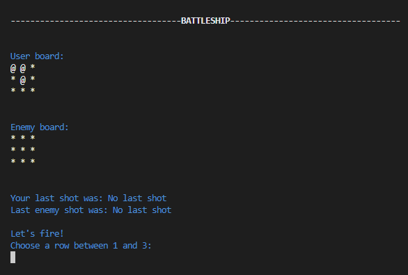

Win message:

Loose message:

Draw message:

## Deployment 

Steps to the deployment:

1. All installed packages in Gitpod,  would need to be added to a list of requirements. 
- To do this, type "pip3 freeze > requirements.txt". This updates the requirements.txt file.
- Commit and push to Github.
- Heroku uses this list to install the dependencies into the application.
- No need to do this, no packages are used.
2. In the Heroku dashboard, click on 'create a new app'.
3. Choose a name for the app; every app must have a unique name.
4. Selected the region and click create app. 
5. Click on settings. 
6. There was no sensitive data to protect
7. Add the buildpacks needed by clicking on the buildpack button.
 - Select Python and Node.js.
8. Click deploy.
9. Select github as the deployment method and clicked connect to github.
10. Connect to the correct repository.
11. Option: automatic deployment.

## Credits 

- [Google drawings](https://docs.google.com) - This was used to create the flow chart in the planning process for this project. 
- GitHub Python Template from [Code Institute](https://github.com/Code-Institute-Org/python-essentials-template)
- Heroku deployment instructions from Code Institute
- [et9719 hangman's project](https://github.com/et9719/hangman), which gave me the idea for the title() function in the run.py file.

